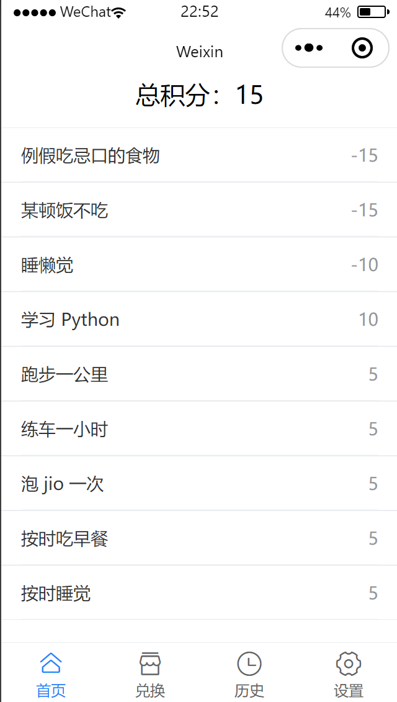
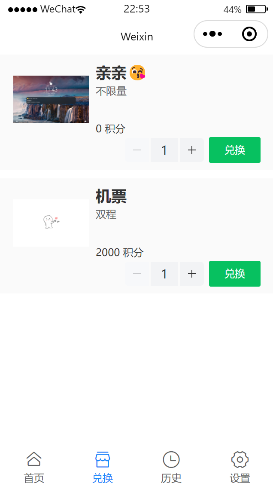
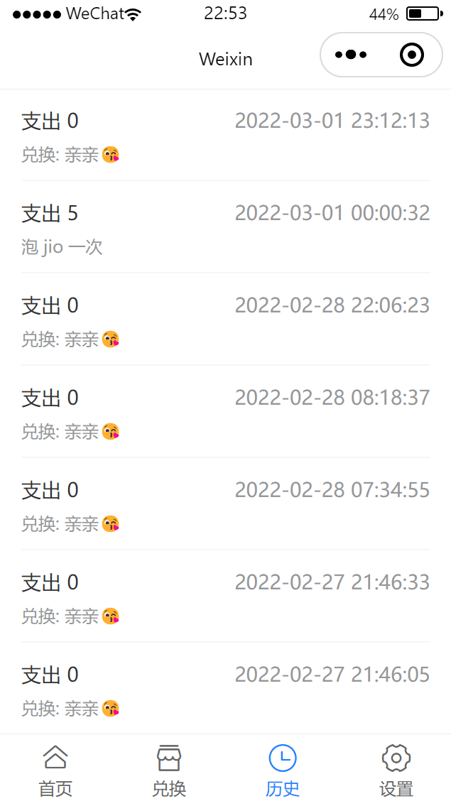
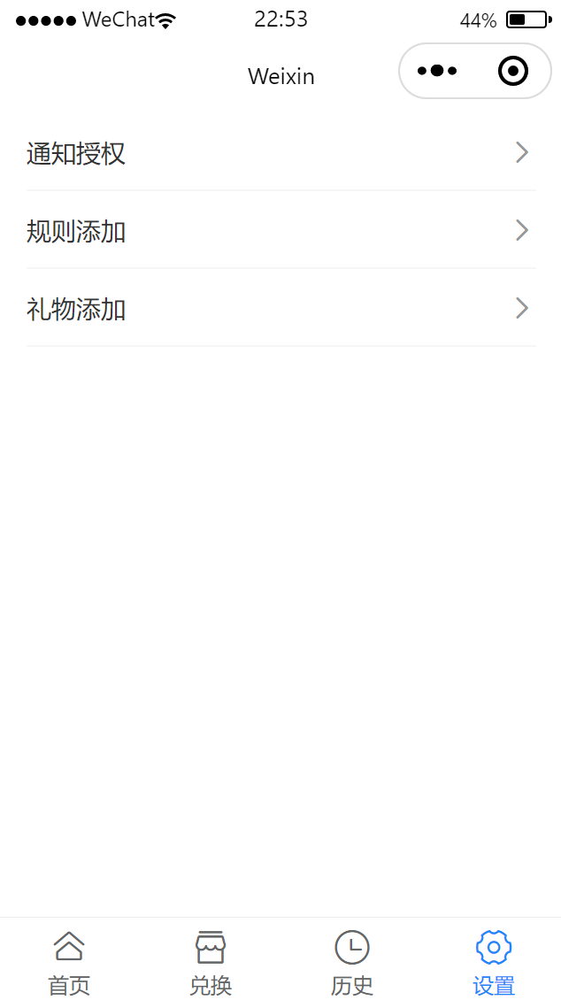
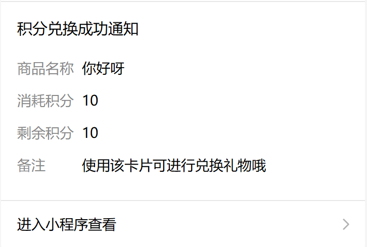

## 积分小程序

### 如何部署

下载微信开发者工具，并且打开该项目，修改 `project.config.json` 中 `appid` 为自己的 `appid`.

修改 `utils/index.js` 中的变量，更改使用自己的消息模板 `id` ，并且使用自己的云开发环境 `Env`。

```js
export const MessageTemplateid = "dseD7bfr8zA344SHJDrEqBrXGr0A25cZY1ZscPZMr0E"; 
export const Env = "xxx"
```
修改 `cloudfunctions/sendMessage/index.js` 中 `MessageTemplateid` 修改成自己模板 `id` 号(与上述保持一致)，现在使用的公共模板为: **积分兑换成功通知**

```
const MessageTemplateid = "xxx"; 
```


将 `cloudfunctions` 中的云函数上传并部署

使用 `npm install or yarn install` 安装相关依赖，并且通过微信开发者工具中的 `工具 > 构建npm` 进行构建，然后便可以进行预览。

> 注意，van-field  组件目前在模拟机上显示会出现问题，建议使用真机模拟


### 效果 
#### 主页


#### 兑换界面



#### 历史界面



#### 设置界面



#### 积分兑换成功

